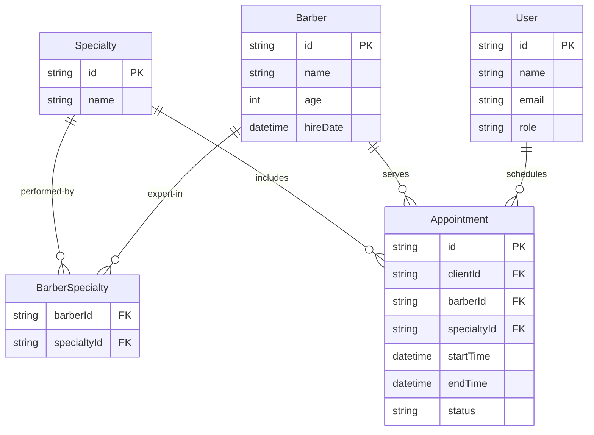

# Diagrama Entidade-Relacionamento (DER) - ClickBeard

Este documento descreve a estrutura do banco de dados e os relacionamentos entre as entidades do sistema.

## Descrição das Entidades

### 1. User
Armazena tanto os clientes quanto os administradores. A diferenciação é feita pelo campo `role`.

### 2. Barber
Os profissionais da barbearia. Cada barbeiro pode ter múltiplas especialidades.

### 3. Specialty
Os serviços oferecidos (ex: Corte, Barba, Sobrancelha).

### 4. BarberSpecialty
Tabela de ligação (Many-to-Many) que define quais serviços cada barbeiro está apto a realizar.

### 5. Appointment
A entidade central que une o **Cliente**, o **Barbeiro**, o **Serviço** e o **Horário**.
