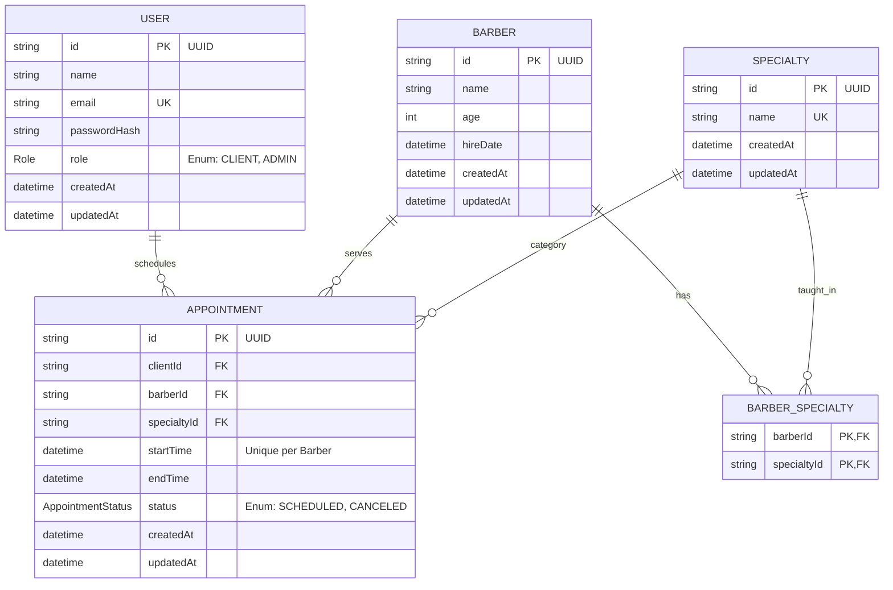

# Diagrama Entidade-Relacionamento (DER) - ClickBeard

Este documento descreve a estrutura do banco de dados e os relacionamentos entre as entidades do sistema, refletindo fielmente a implementação atual no Prisma.

## Descrição das Entidades

### 1. User
Armazena tanto os clientes quanto os administradores. 
- **`role`**: Controlado por um Enum (`CLIENT`, `ADMIN`).
- **`passwordHash`**: Armazena a senha criptografada do usuário.
- **`email`**: Possui restrição de unicidade (Unique Key).

### 2. Barber
Os profissionais da barbearia. 
- Cada barbeiro possui um conjunto de especialidades associadas via `BarberSpecialty`.

### 3. Specialty
Os tipos de serviços oferecidos (Corte, Barba, etc).
- O `name` é único para evitar duplicidade de categorias.

### 4. BarberSpecialty
Tabela de ligação (Many-to-Many) que define quais serviços cada barbeiro está apto a realizar.
- Implementada com uma chave primária composta (`barberId` + `specialtyId`).

### 5. Appointment
Entidade central do agendamento.
- **`status`**: Controlado por um Enum (`SCHEDULED`, `CANCELED`).
- **Restrição de Horário**: O sistema garante que um mesmo barbeiro não possua mais de um agendamento no mesmo `startTime` (Unique Constraint).

---
*Nota: Todas as entidades possuem campos de auditoria `createdAt` e `updatedAt` gerenciados automaticamente pelo Prisma.*
